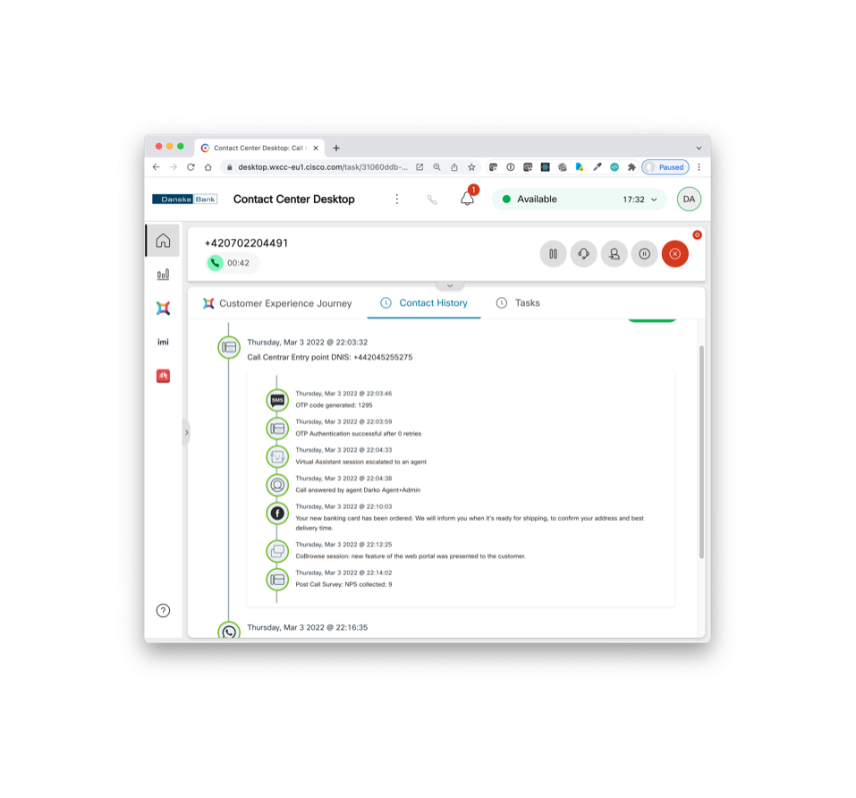
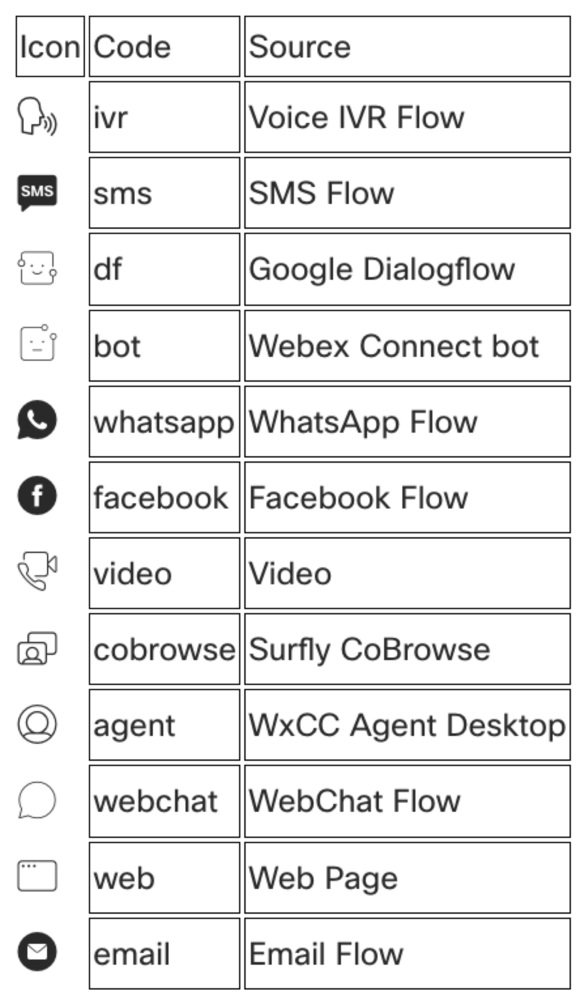
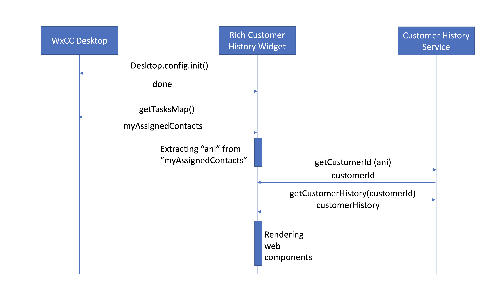

---
# WxCC Custom Widget: Rich Customer History


## Introduction

Out of box WxCC Desktop currently offers contact history, but only for the interactions of the same type as the current one, without additional details about what happened withing the specific channel communication with the customer. Our custom widget includes rich customer history for both voice and digital interactions, allowing agents to quickly gain the understanding of what exactly happened during specific customer interaction of any type, in the past or the current one. It also allows the agent to monitor execution of tasks initiated in the backend systems during agent desktop session. This way agents get better visibility and increased empowerment to provide better customer service. 

In this example, the agent can see that during some previous phone call, after the customer is authenticated with one time password sent via SMS, then she requested from Virtual Assistant an escalation to an agent. Upon connection, the agent-initiated banking card replacement process that was covered with Facebook Messenger dialog, then the agent showed some things to the customer via CoBrowse session. Finally, after agent was disconnected, the customer got opportunity to leave feedback in a post call survey where he provided NPS score 9. This gives the agent a plenty of context about the customer...

Here we would refer as parent events those on the main timeline, while events we get with expansion of parent nodes we refer as children events.

### Event Types

In current version, Rich Customer History support following Event Types.
 



## How to deploy

Before you deploy the actual widget, it is important to understand backend service and use it to establish event feeds in your environment. 

### Backend Customer History Service

This custom component was developed with very simple REST backend service, without any security features, but still relevant for showing the business value of high customization capabilities of WxCC Contact Center Agent Desktop.

In production, this component should be adjusted to use either Customer Journey as a Service (https://cjaas.cisco.com/home) once it is available, or similar APIs from CRM providers. Perhaps making a secure REST service proxy may be to optimal path. Here we are concerned just about demo usage, for what a simple REST service is quite sufficient.

Depending on your interaction type, you would typically have either customer ANI or EMAIL. Service is using customer "username" attribute as the main parameter, so to get it, based on the interaction type, you would either use:


- GET https://SERVICE_HOME/getuserdata?ani=ANI or
- GET https://SERVICE_HOME/getuserdata?email=EMAIL

and parse *"username"* out of JSON response.

With **USERNAME** as parameter, getting customer history is done with: 

- GET https://SERVICE_HOME/history?username=USERNAME

while writing an event into the history is done with 

- POST https://SERVICE_HOME/history
 with body of the request:

```
{
  "username": value is string, USERNAME parameter, mandatory
  "parent": value is string, empty one for parent events, and parent event id for children events,
  "level": value is number 1 for parent events, number 2 for children events
  "channel": value is string, "voice" or "digital"
  "source" : value is string, a "Code" from Event Types table below, mandatory
  "note": value is a string, description of the event 
  "link": value is empty string, reserved for future extensions
}
```
Response is: 

```
{
    "id": value is string, an id of created event 
}
```

You can also reset the customer history with 

- DELETE https://SERVICE_HOME/history
 with body of the request:

```
{
  "username": value is string, USERNAME 
}
```
---
**NOTE:** the backend SERVICE_HOME used for development and testing is running in IBM Node Red, the flow would be published here shortly.
---

With above information you would be able to design your event structure by adding REST API calls in WxCC voice and digital flows, as well as in any other custom widget code, or HTML page.

Typically, you would want to place a parent event at the beginning of routing flow for voice interactions, save event id as parameter and use it as parent for all subsequent events during that voice call, so it's good idea to pass that parameter to the desktop as well. Depending in the needs, you can generate an event on every major IVR decision point, intent recognized by Dialogflow, etc. You also should generate events in flow events, especially when the call is connected to an agent, and include "agent" as source parameter (see Event Table above). Similarly, you would do for digital flows. Also, in "note" parameter would like to use description unriched with relevant variables.

### Desktop Layout Configuration 

You can copy the code below into your desktop layout, into "area"->"panel"->"children" list.

```
        {
          "comp": "md-tab",
          "attributes": { "slot": "tab", "class": "widget-pane-tab" },
          "children": [
            { "comp": "md-icon", "attributes": { "name": "icon-recents_16" } },
            { "comp": "span", "textContent": "Customer History" }
          ]
        },
        {
          "comp": "md-tab-panel",
          "attributes": { "slot": "panel", "class": "widget-pane" },
          "children": [            {
            "comp": "customer-history",
            "script":"https://ciscoemearwxcccustomwidgents.s3.eu-central-1.amazonaws.com/customer-history/2.2/customer-history.js",
            "attributes": {
              "isDarkMode": "$STORE.app.darkMode"
            }
          }]
        }, 
```

## How to customize and rebuild 

Best way to start would be to review documentation: https://developer.webex-cx.com/documentation/guides/desktop and learn about building Custom Widgets.

1. The very first step would be to clone this repository: https://github.com/CiscoDevNet/webex-contact-center-widget-starter .

2. Rename the folder to something like "rich-customer-history-XYZ" or what ever you find good for you.

3. Replace all files in starter widget repository react folder with those provided in THIS repository. The best would be to do it one file by one so that you don't loose any of the files or folders you got from original startes repository.

4. In [Asp.tsx](./react/src/direflow-component/App.tsx) file, in line 16 change version number to "something else". 

5. Change value "SERVICE_HOME" in line 18 of the same file to valid value see note above, withing **Backend Service** section.

6. Run **yarn** command in the folder you renamed in step 2.

7. Run **yarn** command in **/react** subfolder, and then in the same folder run **yarn build** command. This will generate **/build** folder under **/react**. Use the same "something else" value from step 5 to rename **/build** directory to. This is the folder you would be publishing in next step.

8. Once built, the component should be deployed on public URL, [AWS](https://aws.amazon.com/getting-started/hands-on/host-static-website/), [Google Cloud](https://cloud.google.com/storage/docs/hosting-static-website), [Microsoft Azure](https://docs.microsoft.com/en-us/azure/storage/blobs/storage-blob-static-website-host), [IBM Bluemix](https://www.ibm.com/cloud/blog/deploying-static-web-sites?mhsrc=ibmsearch_a&mhq=deploy%20static%20web%20page), [Heroku](https://gist.github.com/wh1tney/2ad13aa5fbdd83f6a489), [Digital Ocean](https://www.digitalocean.com/community/tutorials/how-to-deploy-a-static-website-to-the-cloud-with-digitalocean-app-platform) or any other option of your choice...

## Component Flow



## How To Report Errors and Propose Improvements

Please contact Darko Zlatic (dzlatic@cisco.com) & Carles Duz Palau (cpalau@cisco.com).

